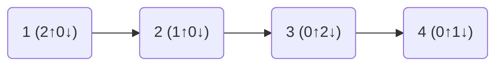

# Day 18: Snailfish

[Full info here](https://adventofcode.com/2021/day/18)

Originally, I was thinking this puzzle would work as a binary tree. The idea of
each pair having a left and right element seemed to match up.

However, in C++ there would have been a decent bit of code to deal with a pair's
elements being either a number or another pair. Doable, but not trivial and not
all that elegant.

Ultimately, the deal breaker for this approach was the need to identify the
left and right leaf nodes for each split/explode operation. I probably would have
continued if the logic had been contained within a single node, but didn't want
to pursue something that required holding onto more than one node at a time.

So instead, I modelled each number as a flat list, reading left to right. For
each number, I also store the count of pushed '[' before, and the number of popped
']' after.

For example:
```
[[1,[2,3]],4]
```
becomes:



The depth of any pair is given by adding the number of pushes and subtracing the
number of pops, left to right.

A regular pair (like `[2,3]`) has a pop count of zero for the left element, and a
push count of zero for the right.

Converting a number to a pair or a pair to a number is just inserting or removing
from the list.

Calculating the magnitude using a stack just requires making the same number of
pushes and pops as what is recorded for each number element.

The main benefit to this approach is that the nearest regular number to the left
or right is always easy to find.
